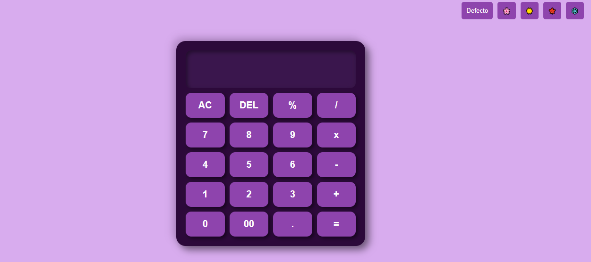
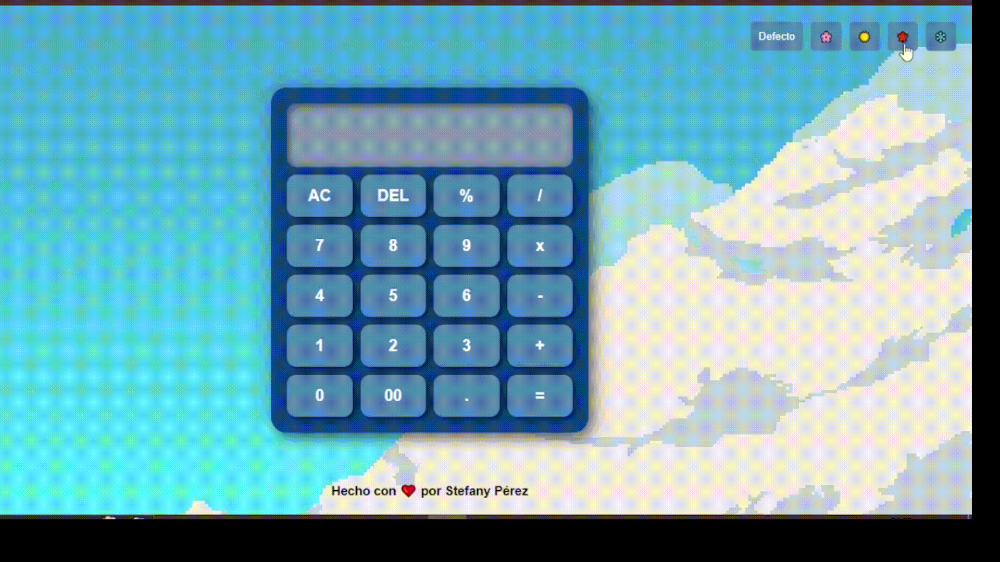

# Calculadora con Temas Estacionales 🎨

Una calculadora web interactiva con temas visuales inspirados en las cuatro estaciones del año, desarrollada con HTML, CSS y JavaScript vanilla.

## 📍 Demo

## ✨ Características

- Operaciones matemáticas básicas (suma, resta, multiplicación, división)
- Cálculo de porcentajes
- Temas visuales basados en las estaciones:
  - Primavera 🌸
  - Verano ☀️
  - Otoño 🍁
  - Invierno ❄️
- Diseño responsivo
- Interfaz intuitiva y amigable

## 🛠️ Tecnologías Utilizadas

  
  
  

## 🎯 Funcionalidades

- **Operaciones Matemáticas:**
  ➕ Suma
  ➖ Resta
  ✖️ Multiplicación
  ➗ División
  💯 Porcentajes

- **Controles Adicionales:**

  - AC (Borrar todo)
  - DEL (Borrar último dígito)
  - Decimales

🔄 AC - Reinicio completo
⌫ DEL - Borrar último dígito
⚡ = - Calcular resultado

- **Temas Estacionales:**
  - Cada tema incluye su propio esquema de colores
  - Cambio dinámico sin afectar la funcionalidad
  - Botón de tema por defecto

🌸 Primavera
☀️ Verano
🍁 Otoño
❄️ Invierno

## 📱 Diseño Responsivo

La calculadora está optimizada para diferentes tamaños de pantalla:

- Escritorio
- Tablet
- Móvil

## 🚀 Uso

1. Selecciona un tema estacional usando los botones en la parte superior derecha
2. Ingresa números usando el teclado numérico
3. Realiza operaciones usando los operadores disponibles
4. Presiona '=' para obtener el resultado
5. Usa 'AC' para limpiar todo o 'DEL' para borrar el último dígito

## 👩‍💻 Autor

Desarrollado con ❤️ por [Stefany Pérez](https://github.com/StefanyPerezBz)
