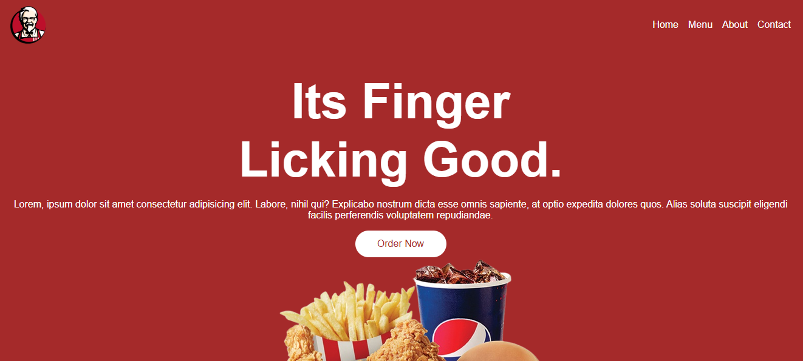

# 🍔 Landing Page de Comida Rápida

Una página web simple, elegante y moderna para un restaurante de comida rápida.

## ✨ Características

- 📱 Diseño totalmente responsive
- 🎨 Estilo moderno y atractivo
- 🍟 Imágenes apetitosas de productos
- 📍 Menú de navegación fácil de usar
- 🔥 Efectos visuales suaves

## 🛠️ Tecnologías

  
  
  

## 💻 Cómo usar

1. Clona este repositorio
2. Abre el archivo `index.html` en tu navegador
3. ¡Listo! 🎉

## 📱 Responsive

El sitio se adapta perfectamente a:
- Computadoras de escritorio
- Tablets
- Teléfonos móviles

---
Hecho con ❤️ 